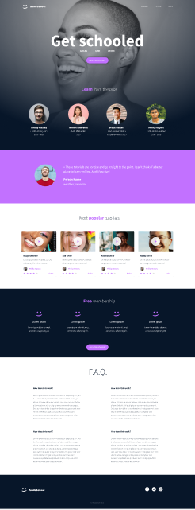

# Project Badge

## Overview
In this and coming projects, you will implement from scratch a webpage from a designer file.

For this first project, you will focus on the HTML structure only - no CSS, no style - just pure HTML semantic.

## Concepts Covered
For this project, you are expected to be familiar with the following concepts:
- HTML elements and structure
- Semantic HTML
- Markup language and the DOM
- HTML tags and attributes
- HTML validation

## Resources
To assist with this project, the following resources are recommended:
- [Learn to Code HTML & CSS](https://learn.shayhowe.com/html-css/) (until “Creating Lists” included)
- [Introduction to HTML](https://developer.mozilla.org/en-US/docs/Web/HTML/Introduction)
- [MDN Web Docs](https://developer.mozilla.org/en-US/docs/Web)
-  Link: [Page in Figma ](https://www.figma.com/design/XrEAsu1vQj5fhVaNG38d2W/Homepage?node-id=0-1&t=BG8um8lk2Pw0QgRx-0)

## Learning Objectives
By the end of this project, you should be able to:
- Explain what HTML is
- Create an HTML page from a wireframe
- Understand and use markup language and the DOM
- Identify and use different HTML elements, tags, and attributes
- Understand the purpose of each HTML tag

## Requirements
- All files should end with a new line
- A `README.md` file at the root of the project folder is mandatory
- Only HTML/CSS/JavaScript can be used (No NodeJS, React, VueJS, Bootstrap, etc.)
- Code should be W3C compliant and validate with W3C-Validator

## Tasks

### 0. README and Objectives
- Implement a webpage from a designer file focusing on HTML structure.
- Use the designer file available on Figma.

### 1. Header
- Create the HTML skeleton with `html`, `head`, and `body` tags.
- Add a `header` tag with:
  - A `link` element containing an image
  - A block of 3 `link` elements

### 2. Banner
- Inside the `header`, add a `section` element with:
  - A block containing:
    - A `h1` tag
    - A text element
    - A `button` tag
  - Another block containing:
    - A `h2` tag
    - A block containing 4 sub-blocks, each with:
      - An image
      - A `h3` tag
      - A text
- Add a `main` element under the `header`.

### 3. Quote
- Under the banner, add a new `section` for the quote:
  - A block containing:
    - An image
    - A sub-block with:
      - A `blockquote` tag
      - A text tag for the author
      - Another text

### 4. Videos
- Add a new `section` containing:
  - A `h1` tag
  - A block with 4 video blocks, each containing:
    - An image
    - A `h2` tag
    - A text
  - A block for author information:
    - An image
    - A `h3` tag
    - A block for rating:
      - A block of images (one star = one image)
      - A text

### 5. Membership
- Add a new `section` containing:
  - A `h1` tag
  - A block with 4 items, each containing:
    - An image
    - A `h2` tag
    - A text
    - A `button`

### 6. FAQ
- Add a new `section` containing:
  - A `h1` tag
  - A block with 2 “row blocks,” each containing 2 “item blocks,” each composed of:
    - A `h2` tag
    - A text

### 7. Footer
- Add a `footer` with:
  - A block for centering the footer content, inside this block:
    - Another block with:
      - An image
      - Another block containing:
        - 3 images with links
        - A text

